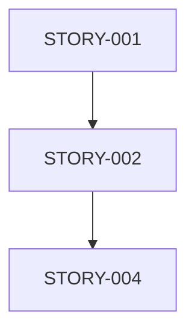

# Product Owner /groom Command Quick Reference

## Overview
The `/groom` command executes comprehensive backlog grooming through 18 parallel subtasks, transforming documentation into an optimized, prioritized backlog.

## Command Syntax
```bash
/groom [options]
  --source <path>         # Documentation source (default: $PROJECT_DOCS)
  --output <path>         # Output directory (default: $PROJECT_DOCS/backlog)
  --sprint-length <days>  # Sprint duration (default: 14)
  --team-velocity <pts>   # Team velocity (default: 40)
  --focus-areas <list>    # Specific areas to prioritize
```

## Example Usage
```bash
# Basic grooming with defaults
/groom

# Custom sprint length and velocity
/groom --sprint-length 10 --team-velocity 50

# Focus on specific areas
/groom --focus-areas "authentication,payments"
```

## Execution Phases

### Phase 1: Documentation Analysis (Parallel)
- Domain model extraction
- Feature requirement identification  
- Technical debt analysis
- Integration point mapping
- Compliance requirement gathering

### Phase 2: Epic Generation (Parallel)
- Feature epics from requirements
- Technical epics from debt/infrastructure
- Integration epics from dependencies
- Compliance epics from regulations

### Phase 3: Story Decomposition (Parallel)
- Break epics into commit-level stories
- Estimate story points and complexity
- Map story dependencies

### Phase 4: Optimization (Parallel)
- Build dependency graph
- Calculate business value/ROI
- Assess implementation risks
- Identify parallel work streams

### Phase 5: Sprint Planning
- Allocate stories to sprints
- Optimize team capacity
- Balance workload

## Output Artifacts

### 1. Backlog Manifest (`backlog-manifest.yaml`)
```yaml
epics:
  - id: EPIC-001
    title: "User Authentication"
    stories: [STORY-001, STORY-002]
    priority: P0
    business_value: 85
```

### 2. Dependency Graph (`dependencies.mermaid`)


### 3. Sprint Plan (`sprint-plan.md`)
```markdown
## Sprint 1
- STORY-001: Database setup (3 pts)
- STORY-020: Component library (5 pts)
```

### 4. Parallel Tracks (`parallel-tracks.json`)
```json
{
  "tracks": [
    {
      "name": "Frontend",
      "independent": true,
      "stories": ["STORY-020", "STORY-021"]
    }
  ]
}
```

## Synthesis Patterns Used

1. **Epic Coherence Validator** - Prevents overlap, ensures coverage
2. **Story Dependency Resolver** - Optimizes execution order
3. **Sprint Capacity Optimizer** - Balances team workload
4. **Business Value Maximizer** - Prioritizes by ROI
5. **Risk-Adjusted Planner** - Creates realistic timelines

## Performance Metrics
- **Sequential Time**: 30-45 minutes
- **Parallel Time**: 5-10 minutes
- **Efficiency Gain**: 80%+
- **Typical Output**: 10-20 epics, 50-100 stories

## Best Practices

1. **Preparation**
   - Ensure documentation is comprehensive
   - Have PRD and architecture docs ready
   - Know team velocity and capacity

2. **Execution**
   - Run during planning sessions
   - Review outputs with team
   - Adjust parameters based on results

3. **Post-Grooming**
   - Validate dependencies with architects
   - Review priorities with stakeholders
   - Adjust sprint allocation as needed

## Troubleshooting

### Common Issues
- **"Documentation not found"** - Check --source path
- **"Velocity too low"** - Increase --team-velocity or reduce scope
- **"Too many dependencies"** - Review architecture for decoupling opportunities

### Tips
- Start with default parameters
- Use focus-areas for specific features
- Review synthesis reports for insights
- Iterate based on team feedback