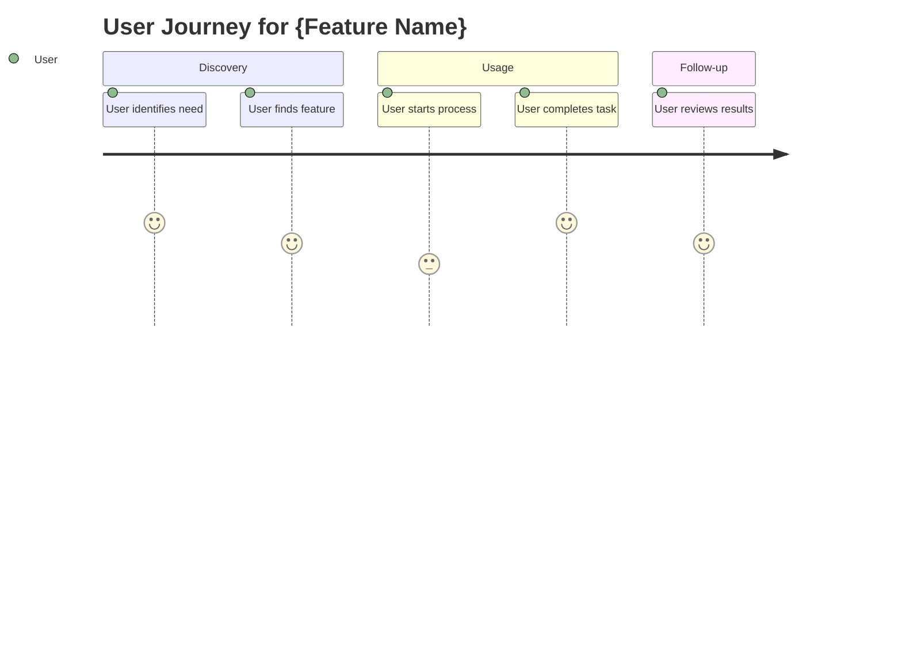

# Feature Specification Template

## Feature: {Feature Name}

### Document Version: {Version}

### Last Updated: {Date}

### Author: {Name}

### Stakeholders: {List of key stakeholders}

---

## Executive Summary

### Feature Overview

{Brief 2-3 sentence description of what this feature does and why it's important}

### Business Value

{Clear statement of the business value this feature delivers}

### Success Metrics

{Key metrics that will indicate success of this feature}

---

## Feature Details

### User Problem Statement

**Problem:** {Detailed description of the user problem being solved}  
**Current Pain Points:**

- {Pain point 1}
- {Pain point 2}
- {Pain point 3}

### Target Users

**Primary Users:** {Description of primary user group}  
**Secondary Users:** {Description of secondary user group}  
**User Personas:** {Link to or brief description of relevant personas}

### Use Cases

1. **{Use Case Title}**
   - **Actor:** {Who performs this use case}
   - **Goal:** {What they want to achieve}
   - **Steps:**
     1. {Step 1}
     2. {Step 2}
     3. {Step 3}
   - **Success Criteria:** {How we know it succeeded}

2. **{Use Case Title}**
   - {Follow same format}

---

## Functional Requirements

### Core Functionality

| Requirement ID | Description | Priority | Acceptance Criteria |
|----------------|-------------|----------|-------------------|
| FR-001 | {Requirement description} | Must Have | {Criteria} |
| FR-002 | {Requirement description} | Should Have | {Criteria} |
| FR-003 | {Requirement description} | Could Have | {Criteria} |

### Business Rules

1. **{Rule Name}:** {Description of business rule}
2. **{Rule Name}:** {Description of business rule}
3. **{Rule Name}:** {Description of business rule}

### Data Requirements

| Data Element | Type | Source | Validation Rules | Storage Requirements |
|--------------|------|--------|------------------|-------------------|
| {Element} | {Type} | {Source} | {Rules} | {Requirements} |

---

## Non-Functional Requirements

### Performance Requirements

- **Response Time:** {Requirement}
- **Throughput:** {Requirement}
- **Concurrent Users:** {Requirement}
- **Data Volume:** {Requirement}

### Security Requirements

- **Authentication:** {Requirements}
- **Authorization:** {Requirements}
- **Data Protection:** {Requirements}
- **Audit Logging:** {Requirements}

### Usability Requirements

- **Accessibility:** {WCAG level, specific requirements}
- **Browser Support:** {Supported browsers and versions}
- **Mobile Compatibility:** {Requirements}
- **User Training:** {Requirements}

### Reliability Requirements

- **Availability:** {Uptime requirements}
- **Error Recovery:** {Recovery requirements}
- **Backup/Restore:** {Requirements}
- **Monitoring:** {Requirements}

---

## User Experience Design

### User Journey

### Key User Interactions

1. **{Interaction Name}**
   - **Trigger:** {What initiates this interaction}
   - **User Action:** {What the user does}
   - **System Response:** {How the system responds}
   - **Feedback Provided:** {What feedback user receives}

### Information Architecture

{Description or diagram of how information is organized and accessed}

### Wireframes/Mockups

{Links to or embedded wireframes, mockups, or prototypes}

---

## Technical Considerations

### System Integration

| Integration Point | System/Service | Data Exchange | Authentication | Error Handling |
|------------------|----------------|---------------|----------------|----------------|
| {Point} | {System} | {Data} | {Auth} | {Handling} |

### Data Model Changes

{Description of any changes to existing data models or new data structures needed}

### API Requirements

| Endpoint | Method | Purpose | Request Format | Response Format |
|----------|--------|---------|----------------|-----------------|
| {Endpoint} | {Method} | {Purpose} | {Format} | {Format} |

### Technology Stack

- **Frontend:** {Technologies/frameworks}
- **Backend:** {Technologies/frameworks}
- **Database:** {Database technologies}
- **Third-party Services:** {External services}

---

## Implementation Plan

### Development Phases

#### Phase 1: {Phase Name} - {Timeline}

**Goals:** {Phase objectives}  
**Deliverables:**

- {Deliverable 1}
- {Deliverable 2}
- {Deliverable 3}

#### Phase 2: {Phase Name} - {Timeline}

**Goals:** {Phase objectives}  
**Deliverables:**

- {Deliverable 1}
- {Deliverable 2}

### User Stories Breakdown

| Epic | Story ID | Story Title | Priority | Effort Estimate |
|------|----------|-------------|----------|-----------------|
| {Epic} | US-001 | {Title} | High | {Estimate} |
| {Epic} | US-002 | {Title} | High | {Estimate} |
| {Epic} | US-003 | {Title} | Medium | {Estimate} |

---

## Testing Strategy

### Test Scenarios

#### Functional Testing

1. **{Scenario Name}**
   - **Given:** {Initial conditions}
   - **When:** {Action taken}
   - **Then:** {Expected result}

#### Integration Testing

1. **{Integration Test}**
   - **Systems Involved:** {Systems}
   - **Test Objective:** {Objective}
   - **Success Criteria:** {Criteria}

#### User Acceptance Testing

1. **{UAT Scenario}**
   - **User Role:** {Role}
   - **Business Scenario:** {Scenario}
   - **Acceptance Criteria:** {Criteria}

### Performance Testing

- **Load Testing:** {Requirements and scenarios}
- **Stress Testing:** {Requirements and scenarios}
- **Volume Testing:** {Requirements and scenarios}

---

## Risk Assessment

### Technical Risks

| Risk | Probability | Impact | Mitigation Strategy | Owner |
|------|-------------|--------|-------------------|-------|
| {Risk} | High/Med/Low | High/Med/Low | {Strategy} | {Name} |

### Business Risks

| Risk | Probability | Impact | Mitigation Strategy | Owner |
|------|-------------|--------|-------------------|-------|
| {Risk} | High/Med/Low | High/Med/Low | {Strategy} | {Name} |

### Dependencies

| Dependency | Type | Impact if Delayed | Mitigation |
|------------|------|-------------------|------------|
| {Dependency} | Internal/External | {Impact} | {Mitigation} |

---

## Success Criteria & Metrics

### Launch Criteria

- [ ] All functional requirements implemented and tested
- [ ] Performance requirements met
- [ ] Security requirements satisfied
- [ ] User acceptance testing completed
- [ ] Documentation completed
- [ ] Training materials prepared

### Success Metrics

#### Immediate (0-30 days post-launch)

- **{Metric Name}:** {Target value}
- **{Metric Name}:** {Target value}

#### Short-term (30-90 days post-launch)

- **{Metric Name}:** {Target value}
- **{Metric Name}:** {Target value}

#### Long-term (90+ days post-launch)

- **{Metric Name}:** {Target value}
- **{Metric Name}:** {Target value}

### Monitoring & Analytics

- **Tools Used:** {Analytics tools}
- **Dashboards:** {Dashboard descriptions}
- **Reporting Schedule:** {How often metrics are reviewed}

---

## Launch Plan

### Pre-Launch Activities

- [ ] **{Activity}** - Owner: {Name} - Due: {Date}
- [ ] **{Activity}** - Owner: {Name} - Due: {Date}

### Launch Activities

- [ ] **{Activity}** - Owner: {Name} - Time: {Time}
- [ ] **{Activity}** - Owner: {Name} - Time: {Time}

### Post-Launch Activities

- [ ] **{Activity}** - Owner: {Name} - Due: {Date}
- [ ] **{Activity}** - Owner: {Name} - Due: {Date}

### Rollback Plan

{Description of rollback procedures if launch issues occur}

---

## Support & Maintenance

### Support Requirements

- **User Support:** {Support model and resources}
- **Technical Support:** {Technical support requirements}
- **Documentation:** {User and technical documentation needs}
- **Training:** {Training requirements for users and support staff}

### Maintenance Plan

- **Regular Maintenance:** {Scheduled maintenance activities}
- **Updates:** {How feature will be updated and enhanced}
- **Monitoring:** {Ongoing monitoring requirements}
- **Performance Tuning:** {Performance optimization plan}

---

## Appendices

### Appendix A: Detailed Wireframes

{Links to or embedded detailed design mockups}

### Appendix B: Technical Diagrams

{Architecture diagrams, data flow diagrams, etc.}

### Appendix C: Research and Analysis

{User research, competitive analysis, market research}

### Appendix D: Stakeholder Approvals

{Record of stakeholder reviews and approvals}

---

## Change Log

| Change | Date - Time | Version | Description | Author |
| {Change} | {Date} - {Time} | {Version} | {Description} | {Name} |
