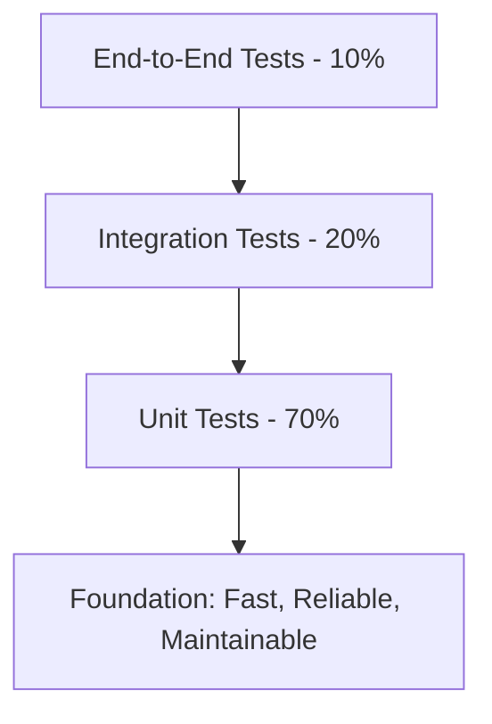

==================== START: test-strategy-tmpl ====================

# {Project Name} Test Strategy Document

## Executive Summary

{Provide a high-level overview of the testing approach, key objectives, and expected outcomes. This section should be accessible to stakeholders who need to understand the testing approach without technical details.}

- **Project Scope:** {Brief description of what will be tested}
- **Testing Objectives:** {Primary goals of the testing effort}
- **Quality Goals:** {Key quality attributes to achieve}
- **Timeline:** {Overall testing timeline and major milestones}
- **Resource Requirements:** {High-level resource needs}

## Testing Scope & Objectives

### In Scope

- {List functional areas, features, and components to be tested}
- {Specify user roles and personas to be validated}
- {Include integration points and external dependencies}
- {Define platforms, browsers, and devices to be tested}

### Out of Scope

- {Clearly define what will NOT be tested and why}
- {Note any limitations or constraints}
- {Reference future testing phases if applicable}

### Testing Objectives

- **Primary Objectives:**
  - {Objective 1: e.g., Validate all critical user journeys work correctly}
  - {Objective 2: e.g., Ensure system performance meets requirements}
  - {Objective 3: e.g., Verify security controls protect user data}
- **Secondary Objectives:**
  - {Additional quality goals and validation targets}

## Risk Assessment & Testing Priorities

### High-Risk Areas

| Risk Area | Impact | Probability | Mitigation Strategy | Testing Priority |
|-----------|--------|-------------|-------------------|------------------|
| {e.g., Payment Processing} | High | Medium | {Comprehensive test coverage, automated regression} | Critical |
| {e.g., User Authentication} | High | Low | {Security testing, penetration testing} | High |
| {e.g., Third-party Integration} | Medium | High | {Service virtualization, contract testing} | High |

### Testing Priorities

- **Critical (P0):** {Core functionality that must work for product viability}
- **High (P1):** {Important features that significantly impact user experience}
- **Medium (P2):** {Standard features with moderate impact}
- **Low (P3):** {Nice-to-have features with minimal impact}

## Testing Approach & Strategy

### Test Pyramid Strategy

### Testing Types & Coverage

#### Functional Testing

- **Unit Testing:**
  - Coverage Target: 80% code coverage
  - Focus: Business logic, algorithms, data transformations
  - Tools: {e.g., Jest, pytest, JUnit}
  - Responsibility: Developers
- **Integration Testing:**
  - Coverage Target: All API endpoints and service interactions
  - Focus: Component interactions, data flow, API contracts
  - Tools: {e.g., Postman, REST Assured, Supertest}
  - Responsibility: QA & Developers
- **End-to-End Testing:**
  - Coverage Target: All critical user journeys
  - Focus: Complete workflows, user scenarios
  - Tools: {e.g., Playwright, Cypress}
  - Responsibility: QA Team

#### Non-Functional Testing

- **Performance Testing:**
  - Load Testing: {Target concurrent users and response times}
  - Stress Testing: {Breaking point identification}
  - Tools: {e.g., JMeter, k6}
- **Security Testing:**
  - Authentication/Authorization validation
  - Input validation and injection prevention
  - Tools: {e.g., OWASP ZAP, Burp Suite}
- **Accessibility Testing:**
  - WCAG 2.1 AA compliance
  - Screen reader compatibility
  - Tools: {e.g., axe-core, WAVE}
- **Compatibility Testing:**
  - Browser Matrix: {List supported browsers and versions}
  - Device Testing: {Mobile, tablet, desktop specifications}
  - Tools: {e.g., BrowserStack, local device lab}

## Test Environment Strategy

### Environment Requirements

- **Development Environment:**
  - Purpose: Developer testing and early validation
  - Data: Synthetic test data
  - Availability: 24/7 developer access
- **QA Environment:**
  - Purpose: Comprehensive testing and validation
  - Data: Production-like test data (anonymized)
  - Availability: Business hours with scheduled downtime
- **Staging Environment:**
  - Purpose: Final validation before production
  - Data: Production mirror (anonymized)
  - Availability: Controlled access, production-like

### Test Data Strategy

- **Data Sources:** {How test data will be created/maintained}
- **Data Privacy:** {Approach to handling sensitive data}
- **Data Refresh:** {Frequency and process for updating test data}
- **Data Cleanup:** {Procedures for maintaining data integrity}

## Testing Tools & Technologies

### Test Management

- **Test Case Management:** {e.g., TestRail, Zephyr, Azure DevOps}
- **Defect Tracking:** {e.g., Jira, GitHub Issues, Azure DevOps}
- **Test Reporting:** {e.g., Allure, ExtentReports, custom dashboards}

### Automation Frameworks

- **UI Automation:** {e.g., Playwright with TypeScript}
- **API Testing:** {e.g., Postman/Newman, REST Assured}
- **Performance Testing:** {e.g., JMeter, k6}
- **CI/CD Integration:** {e.g., GitHub Actions, Jenkins, Azure DevOps}

### Quality Assurance Tools

- **Static Analysis:** {e.g., SonarQube, ESLint, Checkmarx}
- **Security Scanning:** {e.g., Snyk, OWASP Dependency Check}
- **Accessibility Testing:** {e.g., axe-core, Pa11y}

## Quality Gates & Acceptance Criteria

### Entry Criteria

- [ ] Requirements are complete and reviewed
- [ ] Test environment is available and configured
- [ ] Test data is prepared and validated
- [ ] Code is developed and unit tested
- [ ] Build is stable and deployable

### Exit Criteria

- [ ] All planned test cases executed with {X}% pass rate
- [ ] No critical or high-priority defects remain open
- [ ] Performance benchmarks met
- [ ] Security requirements validated
- [ ] Accessibility compliance verified

### Quality Metrics

- **Test Coverage:** {Minimum acceptable coverage percentages}
- **Defect Density:** {Acceptable defects per feature/KLOC}
- **Test Execution:** {Target execution time and pass rates}
- **Automation Coverage:** {Percentage of tests automated}

## Resource Planning & Timeline

### Team Structure

- **QA Lead:** {Responsibilities and time allocation}
- **QA Engineers:** {Number needed and skill requirements}
- **Automation Engineers:** {Specialized automation skills}
- **Performance Testers:** {If specialized performance testing needed}

### Timeline & Milestones

| Phase | Duration | Key Deliverables | Dependencies |
|-------|----------|------------------|--------------|
| Test Planning | {X weeks} | Test strategy, test plans | Requirements complete |
| Test Development | {X weeks} | Test cases, automation scripts | Design complete |
| Test Execution | {X weeks} | Test results, defect reports | Code development complete |
| Test Closure | {X weeks} | Test summary, lessons learned | All defects resolved |

### Effort Estimation

- **Manual Testing:** {Person-hours per feature/epic}
- **Automation Development:** {Person-hours per automated test}
- **Test Maintenance:** {Ongoing effort for test updates}
- **Regression Testing:** {Effort per release cycle}

## Risk Management & Contingencies

### Testing Risks

| Risk | Impact | Mitigation Strategy | Contingency Plan |
|------|--------|-------------------|------------------|
| {Environment unavailability} | High | {Multiple environment setup} | {Local testing, cloud environments} |
| {Test data corruption} | Medium | {Automated data refresh} | {Backup data sources} |
| {Resource constraints} | High | {Cross-training, external resources} | {Scope reduction, timeline adjustment} |

### Communication Plan

- **Daily Standups:** Test progress and blockers
- **Weekly Reports:** Quality metrics and trend analysis
- **Milestone Reviews:** Comprehensive quality assessment
- **Stakeholder Updates:** Executive summary and key decisions

## Reporting & Metrics

### Test Reporting

- **Daily Reports:** Test execution status and immediate issues
- **Weekly Reports:** Progress against plan, quality trends
- **Milestone Reports:** Comprehensive quality assessment
- **Final Report:** Complete test summary and recommendations

### Quality Metrics Dashboard

- Test execution progress and pass/fail rates
- Defect discovery and resolution trends
- Code coverage and automation coverage
- Performance benchmarks and trends
- Security and accessibility compliance status

## Process Improvement

### Lessons Learned

- Regular retrospectives to identify improvement opportunities
- Documentation of best practices and anti-patterns
- Continuous refinement of testing processes and tools
- Knowledge sharing across projects and teams

### Continuous Improvement

- Automation expansion and optimization
- Tool evaluation and adoption
- Process streamlining and efficiency gains
- Skill development and training programs

## Approval & Sign-off

| Role | Name | Signature | Date |
|------|------|-----------|------|
| QA Lead | {Name} | {Signature} | {Date} |
| Product Manager | {Name} | {Signature} | {Date} |
| Technical Lead | {Name} | {Signature} | {Date} |
| Project Manager | {Name} | {Signature} | {Date} |

## Appendices

### Appendix A: Test Environment Details

{Detailed environment specifications, URLs, access credentials}

### Appendix B: Tool Configuration

{Specific tool setup and configuration details}

### Appendix C: Test Data Specifications

{Detailed test data requirements and setup procedures}

### Appendix D: Risk Register

{Complete risk assessment with detailed mitigation plans}

==================== END: test-strategy-tmpl ====================
