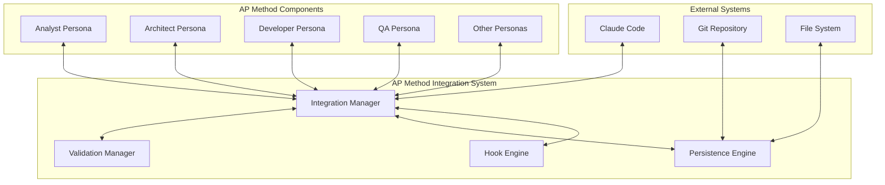
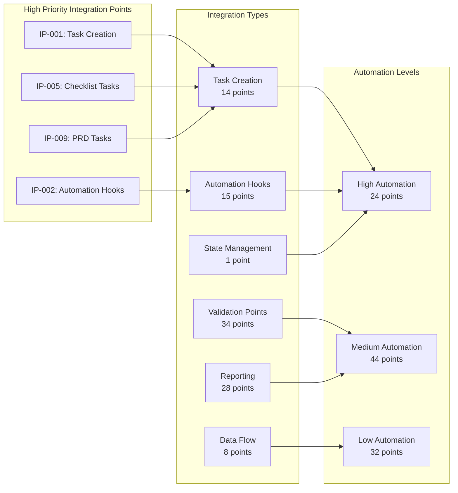
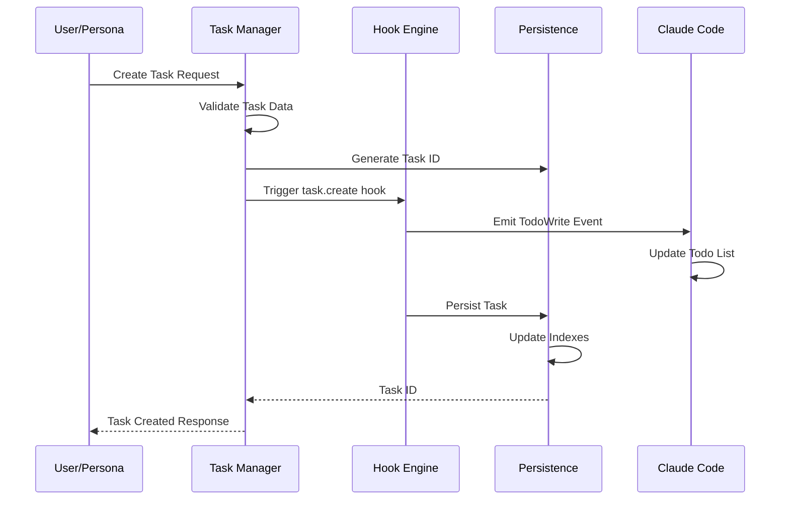
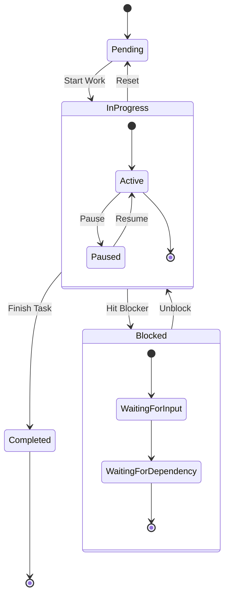
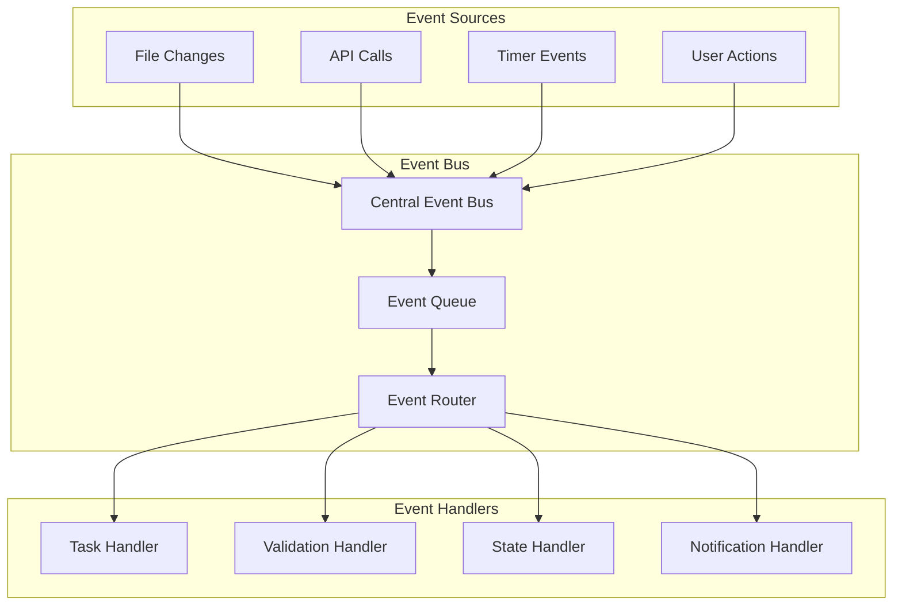
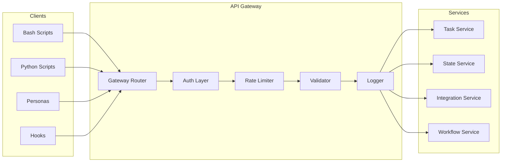
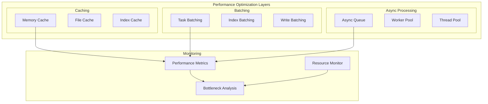
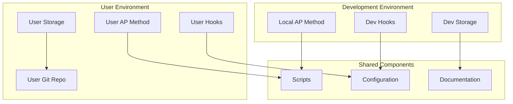
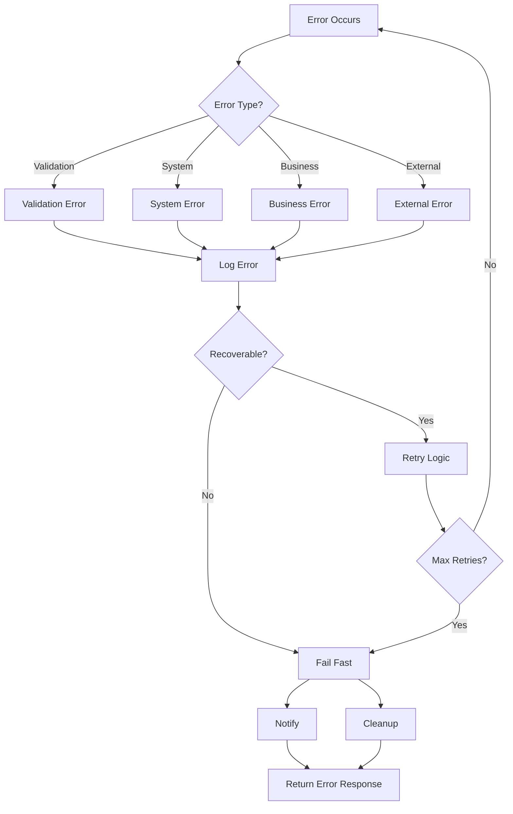

# AP Method Integration Architecture Diagrams

## Overview

This document contains 15+ architecture diagrams that illustrate the complete integration system design. Each diagram is presented in both textual format (using ASCII art and Mermaid notation) for immediate understanding and version control.

## Diagram Index

1. [System Context Diagram](#1-system-context-diagram)
2. [Component Architecture](#2-component-architecture)
3. [Integration Points Overview](#3-integration-points-overview)
4. [Data Flow Architecture](#4-data-flow-architecture)
5. [Task Management Flow](#5-task-management-flow)
6. [Hook Execution Sequence](#6-hook-execution-sequence)
7. [State Management Architecture](#7-state-management-architecture)
8. [Persona Interaction Matrix](#8-persona-interaction-matrix)
9. [Event-Driven Architecture](#9-event-driven-architecture)
10. [Persistence Layer Design](#10-persistence-layer-design)
11. [API Gateway Pattern](#11-api-gateway-pattern)
12. [Validation Pipeline](#12-validation-pipeline)
13. [Performance Architecture](#13-performance-architecture)
14. [Security Architecture](#14-security-architecture)
15. [Deployment Architecture](#15-deployment-architecture)
16. [Monitoring Architecture](#16-monitoring-architecture)
17. [Error Handling Flow](#17-error-handling-flow)
18. [Migration Architecture](#18-migration-architecture)

---

## 1. System Context Diagram



**Description**: High-level view showing how the integration system connects AP Method components with external systems.

---

## 2. Component Architecture

```
┌─────────────────────────────────────────────────────────────────┐
│                    AP Method Integration Platform                │
├─────────────────────────────────────────────────────────────────┤
│                         API Gateway Layer                        │
│  ┌─────────────┐  ┌──────────────┐  ┌───────────────┐         │
│  │ Task API    │  │ Workflow API │  │ Integration   │         │
│  │ v1/v2       │  │ v1           │  │ Point API v1  │         │
│  └─────────────┘  └──────────────┘  └───────────────┘         │
├─────────────────────────────────────────────────────────────────┤
│                      Core Services Layer                         │
│  ┌─────────────┐  ┌──────────────┐  ┌───────────────┐         │
│  │ Task        │  │ Hook         │  │ State         │         │
│  │ Manager     │  │ Orchestrator │  │ Manager      │         │
│  └─────────────┘  └──────────────┘  └───────────────┘         │
│  ┌─────────────┐  ┌──────────────┐  ┌───────────────┐         │
│  │ Validation  │  │ Event        │  │ Workflow      │         │
│  │ Engine      │  │ Bus          │  │ Engine       │         │
│  └─────────────┘  └──────────────┘  └───────────────┘         │
├─────────────────────────────────────────────────────────────────┤
│                     Data Access Layer                            │
│  ┌─────────────┐  ┌──────────────┐  ┌───────────────┐         │
│  │ File-Based  │  │ Index        │  │ Cache         │         │
│  │ Storage     │  │ Manager      │  │ Manager      │         │
│  └─────────────┘  └──────────────┘  └───────────────┘         │
└─────────────────────────────────────────────────────────────────┘
```

---

## 3. Integration Points Overview



---

## 4. Data Flow Architecture

```
┌─────────────┐     ┌─────────────┐     ┌─────────────┐
│   Persona   │     │ Integration │     │   Claude    │
│   Action    │────▶│   Trigger   │────▶│    Code     │
└─────────────┘     └─────────────┘     └─────────────┘
       │                    │                    │
       │                    ▼                    │
       │            ┌─────────────┐              │
       │            │    Hook     │              │
       │            │  Execution  │              │
       │            └─────────────┘              │
       │                    │                    │
       │                    ▼                    │
       │            ┌─────────────┐              │
       └───────────▶│    Data     │◀─────────────┘
                    │ Persistence │
                    └─────────────┘
                            │
                    ┌───────┴───────┐
                    ▼               ▼
            ┌─────────────┐ ┌─────────────┐
            │   State     │ │   Index     │
            │   Store     │ │   Store     │
            └─────────────┘ └─────────────┘
```

---

## 5. Task Management Flow



---

## 6. Hook Execution Sequence

```
┌─────────────────────────────────────────────────────┐
│                 Hook Execution Pipeline              │
├─────────────────────────────────────────────────────┤
│  1. Event Detection                                  │
│     └─▶ File Change / API Call / Timer              │
├─────────────────────────────────────────────────────┤
│  2. Hook Resolution                                  │
│     └─▶ Find Registered Hooks                       │
│     └─▶ Sort by Priority                           │
├─────────────────────────────────────────────────────┤
│  3. Pre-Execution Validation                         │
│     └─▶ Check Permissions                          │
│     └─▶ Validate Context                           │
├─────────────────────────────────────────────────────┤
│  4. Hook Execution                                   │
│     └─▶ Create Sandbox                             │
│     └─▶ Execute Hook Function                      │
│     └─▶ Monitor Resources                          │
├─────────────────────────────────────────────────────┤
│  5. Post-Execution Processing                        │
│     └─▶ Process Results                            │
│     └─▶ Update Metrics                             │
│     └─▶ Trigger Dependent Hooks                    │
└─────────────────────────────────────────────────────┘
```

---

## 7. State Management Architecture



---

## 8. Persona Interaction Matrix

```
         │ Analyst │ PM │ Architect │ Design │ PO │ SM │ Dev │ QA │
─────────┼─────────┼────┼──────────┼────────┼────┼────┼─────┼────┤
Analyst  │    -    │ ██ │    ██    │   █    │ █  │ █  │  █  │ █  │
PM       │   ██    │ -  │    ██    │   ██   │ ██ │ ██ │  █  │ █  │
Architect│   ██    │ ██ │     -    │   ██   │ █  │ █  │  ██ │ ██ │
Design   │    █    │ ██ │    ██    │    -   │ █  │ █  │  ██ │ ██ │
PO       │    █    │ ██ │     █    │    █   │ -  │ ██ │  ██ │ ██ │
SM       │    █    │ ██ │     █    │    █   │ ██ │ -  │  ██ │ █  │
Dev      │    █    │ █  │    ██    │   ██   │ ██ │ ██ │  -  │ ██ │
QA       │    █    │ █  │    ██    │   ██   │ ██ │ █  │  ██ │ -  │

Legend: ██ = High Interaction, █ = Medium Interaction, (blank) = Low
```

---

## 9. Event-Driven Architecture



---

## 10. Persistence Layer Design

```
┌──────────────────────────────────────────────────────┐
│                 Persistence Layer                     │
├──────────────────────────────────────────────────────┤
│  ┌────────────────────────────────────────────────┐  │
│  │              Write Path                         │  │
│  │  Request → Validate → WAL → Write → Index      │  │
│  └────────────────────────────────────────────────┘  │
├──────────────────────────────────────────────────────┤
│  ┌────────────────────────────────────────────────┐  │
│  │               Read Path                         │  │
│  │  Request → Cache Check → Index → File → Result │  │
│  └────────────────────────────────────────────────┘  │
├──────────────────────────────────────────────────────┤
│             Storage Organization                      │
│  .ap-state/                                          │
│  ├── tasks/                                          │
│  │   ├── active/     (Current tasks)                │
│  │   ├── completed/  (Archived by date)             │
│  │   └── index/      (Query indexes)                │
│  ├── states/                                         │
│  │   ├── current/    (Latest state)                 │
│  │   └── history/    (State changes)                │
│  ├── integrations/                                   │
│  │   ├── active/     (Enabled integrations)         │
│  │   └── metrics/    (Performance data)             │
│  └── wal/           (Write-ahead logs)              │
└──────────────────────────────────────────────────────┘
```

---

## 11. API Gateway Pattern



---

## 12. Validation Pipeline

```
Input Document
      │
      ▼
┌─────────────┐
│   Schema    │──❌─→ Reject: Schema Invalid
│ Validation  │
└─────────────┘
      │✓
      ▼
┌─────────────┐
│   Format    │──❌─→ Reject: Format Error
│   Check     │
└─────────────┘
      │✓
      ▼
┌─────────────┐
│  Business   │──❌─→ Reject: Business Rule
│   Rules     │               Violation
└─────────────┘
      │✓
      ▼
┌─────────────┐
│ Consistency │──❌─→ Warning: Inconsistency
│   Check     │               Detected
└─────────────┘
      │✓
      ▼
┌─────────────┐
│  Security   │──❌─→ Reject: Security Risk
│   Scan      │
└─────────────┘
      │✓
      ▼
  Validated
   Document
```

---

## 13. Performance Architecture



---

## 14. Security Architecture

```
┌────────────────────────────────────────────────────┐
│              Security Architecture                  │
├────────────────────────────────────────────────────┤
│  Perimeter Security                                │
│  ┌──────────────┐  ┌──────────────┐              │
│  │ Input        │  │ Path         │              │
│  │ Sanitization │  │ Validation   │              │
│  └──────────────┘  └──────────────┘              │
├────────────────────────────────────────────────────┤
│  Access Control                                    │
│  ┌──────────────┐  ┌──────────────┐              │
│  │ Permission   │  │ Hook         │              │
│  │ Model        │  │ Sandboxing   │              │
│  └──────────────┘  └──────────────┘              │
├────────────────────────────────────────────────────┤
│  Data Protection                                   │
│  ┌──────────────┐  ┌──────────────┐              │
│  │ Sensitive    │  │ Audit        │              │
│  │ Data Masking │  │ Logging      │              │
│  └──────────────┘  └──────────────┘              │
└────────────────────────────────────────────────────┘
```

---

## 15. Deployment Architecture



---

## 16. Monitoring Architecture

```
┌─────────────────────────────────────────────────────┐
│             Monitoring Architecture                  │
├─────────────────────────────────────────────────────┤
│  Data Collection                                     │
│  ┌─────────────┐ ┌─────────────┐ ┌─────────────┐  │
│  │   Metrics   │ │    Logs     │ │   Traces    │  │
│  │ Collector   │ │  Aggregator │ │  Collector  │  │
│  └─────────────┘ └─────────────┘ └─────────────┘  │
├─────────────────────────────────────────────────────┤
│  Processing                                          │
│  ┌─────────────┐ ┌─────────────┐ ┌─────────────┐  │
│  │    Time     │ │  Anomaly    │ │   Alert     │  │
│  │   Series    │ │  Detection  │ │   Engine    │  │
│  └─────────────┘ └─────────────┘ └─────────────┘  │
├─────────────────────────────────────────────────────┤
│  Visualization                                       │
│  ┌─────────────────────────────────────────────┐  │
│  │  Health Dashboard                            │  │
│  │  • System Status  • Performance Metrics     │  │
│  │  • Error Rates    • Integration Status      │  │
│  └─────────────────────────────────────────────┘  │
└─────────────────────────────────────────────────────┘
```

---

## 17. Error Handling Flow



---

## 18. Migration Architecture

```
Current State                Migration Process              Target State
─────────────               ─────────────────              ────────────
                                    │
┌─────────────┐            ┌────────▼────────┐         ┌─────────────┐
│   Manual    │            │    Analyze      │         │  Automated  │
│  Processes  │───────────▶│ Current State   │────────▶│ Integration │
└─────────────┘            └─────────────────┘         └─────────────┘
                                    │
┌─────────────┐            ┌────────▼────────┐         ┌─────────────┐
│   Ad-hoc    │            │    Implement    │         │ Structured  │
│    Tasks    │───────────▶│   Task Model    │────────▶│Task Pipeline│
└─────────────┘            └─────────────────┘         └─────────────┘
                                    │
┌─────────────┐            ┌────────▼────────┐         ┌─────────────┐
│   Siloed    │            │   Connect       │         │ Integrated  │
│   Personas  │───────────▶│   Workflows     │────────▶│  Workflows  │
└─────────────┘            └─────────────────┘         └─────────────┘
```

---

## Architecture Summary

These 18 diagrams provide a comprehensive view of the AP Method Integration Architecture:

1. **System Level**: Context, components, and high-level interactions
2. **Integration Design**: Hook patterns, API contracts, and data flows
3. **Operational View**: Performance, security, monitoring, and error handling
4. **Implementation Guide**: Persistence, validation, and migration strategies

Each diagram serves as a blueprint for implementing specific aspects of the integration system while maintaining consistency with the overall architecture vision.

---

*Architecture Document Version: 1.0*  
*Last Updated: 2025-01-11*  
*Status: Complete architectural diagram set for AC3*