# AP Method Persona Task Management Integration Architecture

## Introduction / Preamble

This document outlines the technical architecture for integrating task management capabilities into the AP Method persona system. The architecture enables each of the 9 specialized AI personas to leverage task management for their specific workflows while maintaining coordination across the entire system.

The primary goal is to create a unified yet flexible task management framework that enhances persona effectiveness, improves cross-persona collaboration, and provides comprehensive visibility into project progress - all while maintaining the simplicity and performance of the existing flat-file task system.

**Relationship to Frontend Architecture:**
This architecture focuses on the backend task management engine and persona integration layer. UI components for dashboards and task visualization will be detailed in a separate Frontend Architecture Document if a web-based interface is implemented.

## Table of Contents

- [Technical Summary](#technical-summary)
- [High-Level Overview](#high-level-overview)
- [Architectural / Design Patterns Adopted](#architectural--design-patterns-adopted)
- [Component View](#component-view)
- [Project Structure](#project-structure)
- [API Reference](#api-reference)
- [Data Models](#data-models)
- [Core Workflow / Sequence Diagrams](#core-workflow--sequence-diagrams)
- [Definitive Tech Stack Selections](#definitive-tech-stack-selections)
- [Infrastructure and Deployment Overview](#infrastructure-and-deployment-overview)
- [Error Handling Strategy](#error-handling-strategy)
- [Coding Standards](#coding-standards)
- [Overall Testing Strategy](#overall-testing-strategy)
- [Security Best Practices](#security-best-practices)
- [Key Reference Documents](#key-reference-documents)
- [Change Log](#change-log)

## Technical Summary

The Persona Task Management Integration architecture extends the existing AP Method flat-file task system to provide persona-specific task management capabilities. Built on bash scripts and markdown files, the system uses a layered architecture with persona adapters, a unified task engine, and cross-persona orchestration. The architecture prioritizes performance (<100ms operations), git-friendliness, and maintainability while enabling sophisticated workflows for each persona.

## High-Level Overview

The architecture follows a **Modular Monolith** pattern with clear separation between the core task engine, persona-specific adapters, and orchestration layer. The system uses a **flat-file database** (single markdown file) with bash-based operations, enhanced by Python-based hooks for advanced functionality.

Repository structure follows a **Monorepo** approach within the existing AP Method project, with all persona integrations co-located for easier cross-persona coordination.

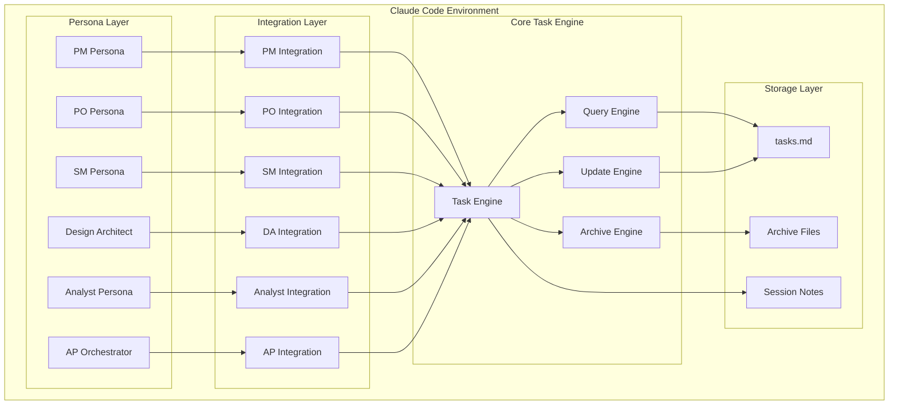

## Architectural / Design Patterns Adopted

- **Adapter Pattern** - Each persona has an adapter that translates persona-specific operations to core task engine operations
- **Command Pattern** - All task operations are encapsulated as commands (extract, query, update, archive)
- **Observer Pattern** - Hook system enables reactive behaviors on task state changes
- **Repository Pattern** - Task storage abstracted behind repository interfaces
- **Facade Pattern** - Simplified interfaces for complex persona workflows
- **Chain of Responsibility** - Task validation and processing pipeline
- **Strategy Pattern** - Different task processing strategies per persona type

## Component View

### Core Task Engine
**Responsibility**: Manages all CRUD operations on tasks, maintains data integrity, handles archival

Components:
- `extract-tasks.sh` - Extracts tasks from story files
- `query-tasks.sh` - Provides filtered task queries
- `update-task.sh` - Updates task properties
- `archive-tasks.sh` - Archives completed tasks

### Persona Integration Adapters
**Responsibility**: Translate persona-specific needs into task engine operations

Components per persona:
- **PM Integration**: Epic tracking, roadmap management, progress aggregation
- **PO Integration**: Story validation, acceptance tracking, backlog prioritization
- **SM Integration**: Sprint planning, velocity tracking, blocker detection
- **Design Architect Integration**: Component tracking, design token management
- **Analyst Integration**: Research task management, insight capture
- **AP Orchestrator Integration**: Cross-persona coordination, bottleneck detection

### Cross-Persona Orchestration
**Responsibility**: Manages handoffs, dependencies, and coordination between personas

Components:
- **Handoff Manager**: Automates context transfer between personas
- **Dependency Tracker**: Monitors cross-persona task dependencies
- **Notification Engine**: Alerts personas of relevant changes

### Dashboard Components
**Responsibility**: Provide real-time visibility into task states and metrics

Components:
- **Persona Dashboards**: Specialized views for each persona
- **System Dashboard**: AP Orchestrator's comprehensive view
- **Metrics Engine**: Calculates velocity, progress, bottlenecks

## Project Structure

```plaintext
{project-root}/
├── agents/
│   ├── integrations/              # Persona integration modules
│   │   ├── pm/
│   │   │   ├── pm-task-manager.sh
│   │   │   ├── epic-tracker.sh
│   │   │   └── roadmap-generator.sh
│   │   ├── po/
│   │   │   ├── po-validation-engine.sh
│   │   │   ├── acceptance-tracker.sh
│   │   │   └── backlog-prioritizer.sh
│   │   ├── sm/
│   │   │   ├── sprint-orchestrator.sh
│   │   │   ├── velocity-tracker.sh
│   │   │   └── blocker-analyzer.sh
│   │   ├── design-architect/
│   │   │   ├── design-task-generator.sh
│   │   │   ├── component-tracker.sh
│   │   │   └── design-token-sync.sh
│   │   ├── analyst/
│   │   │   ├── research-task-manager.sh
│   │   │   ├── interview-tracker.sh
│   │   │   └── insight-capture.sh
│   │   └── orchestrator/
│   │       ├── system-orchestrator.sh
│   │       ├── bottleneck-detector.sh
│   │       └── handoff-manager.sh
│   ├── scripts/                   # Core task management scripts
│   │   ├── extract-tasks.sh
│   │   ├── query-tasks.sh
│   │   ├── update-task.sh
│   │   └── archive-tasks.sh
│   ├── lib/                       # Shared libraries
│   │   ├── task-common.sh         # Common task functions
│   │   ├── validation.sh          # Task validation rules
│   │   └── metrics.sh             # Metrics calculations
│   └── dashboards/                # Dashboard generation scripts
│       ├── generate-dashboard.sh
│       └── templates/
├── .claude/
│   └── hooks/                     # Claude Code hooks
│       ├── task_validation.py     # Task validation hook
│       ├── task_notification.py   # Notification hook
│       └── task_metrics.py        # Metrics collection hook
└── project_documentation/
    ├── session-notes/
    │   └── tasks/
    │       ├── tasks.md           # Central task file
    │       └── archive/           # Archived tasks
    └── dashboards/                # Generated dashboard files
        ├── pm-dashboard.md
        ├── po-dashboard.md
        └── system-dashboard.md
```

### Key Directory Descriptions

- `agents/integrations/`: Contains persona-specific integration modules
- `agents/scripts/`: Core task management scripts (existing)
- `agents/lib/`: Shared functionality across all integrations
- `agents/dashboards/`: Dashboard generation and templates
- `.claude/hooks/`: Python-based hooks for advanced functionality
- `project_documentation/session-notes/tasks/`: Task storage location

## API Reference

### Internal APIs Provided

#### Task Management API (Bash-based)

**Purpose:** Core task operations accessible to all personas

**Base Commands:** Shell scripts in `agents/scripts/`

**Operations:**

- **`extract-tasks.sh [story-file]`**
  - Description: Extracts tasks from a story file and adds to tasks.md
  - Parameters: 
    - `story-file`: Path to story markdown file
  - Output: Task IDs of extracted tasks
  - Example: `./extract-tasks.sh /path/to/STORY-016.md`

- **`query-tasks.sh [options]`**
  - Description: Query tasks with various filters
  - Parameters:
    - `-s [status]`: Filter by status (pending/in-progress/completed)
    - `-p [persona]`: Filter by assigned persona
    - `-e [epic]`: Filter by epic
    - `-t [type]`: Filter by task type
    - `--dependencies`: Show tasks with dependencies
  - Output: Filtered task list in markdown format
  - Example: `./query-tasks.sh -p developer -s pending`

- **`update-task.sh [task-id] [field] [value]`**
  - Description: Update a task field
  - Parameters:
    - `task-id`: Task identifier (e.g., TASK-001-002-01)
    - `field`: Field to update (status/assignee/estimate/priority)
    - `value`: New value
  - Output: Success/failure message
  - Example: `./update-task.sh TASK-001-016-01 status in-progress`

#### Persona Integration APIs

**Purpose:** Persona-specific task management operations

##### PM Integration API

- **`pm-task-manager.sh create-epic-tasks [epic-id]`**
  - Description: Generate task breakdown for an epic
  - Output: Created task IDs

- **`epic-tracker.sh get-progress [epic-id]`**
  - Description: Calculate epic completion percentage
  - Output: Progress metrics JSON

##### PO Integration API

- **`po-validation-engine.sh validate-story [story-id]`**
  - Description: Run validation checks on story tasks
  - Output: Validation report

- **`acceptance-tracker.sh track-criteria [story-id]`**
  - Description: Track acceptance criteria completion
  - Output: Criteria status list

##### SM Integration API

- **`sprint-orchestrator.sh plan-sprint [sprint-id] [story-ids...]`**
  - Description: Extract and organize tasks for sprint
  - Output: Sprint task allocation

- **`velocity-tracker.sh calculate [sprint-id]`**
  - Description: Calculate team velocity metrics
  - Output: Velocity data JSON

## Data Models

### Core Application Entities

#### Task

**Description:** Central task entity used across all personas

**Schema / Interface Definition:**

```typescript
export interface Task {
  id: string;              // Format: TASK-{EPIC}-{STORY}-{SEQUENCE}
  title: string;           // Task title (max 100 chars)
  type: TaskType;          // development/testing/documentation/design/research
  status: TaskStatus;      // pending/in-progress/blocked/review/completed/cancelled
  priority: Priority;      // high/medium/low
  persona: string;         // Assigned persona (developer/qa/architect/etc)
  estimate: string;        // Time estimate (e.g., "8h", "2d")
  dependencies: string[];  // Array of task IDs this depends on
  blockedBy?: string;      // Task ID blocking this task
  description: string;     // Detailed task description
  
  // Metadata
  createdAt: string;       // ISO 8601 timestamp
  updatedAt: string;       // ISO 8601 timestamp
  completedAt?: string;    // ISO 8601 timestamp
  
  // Story context
  storyId: string;         // Parent story ID
  epicId: string;          // Parent epic ID
  
  // Optional fields for specific personas
  acceptanceCriteria?: string[];     // For PO validation
  testScenarios?: string[];          // For QA tasks
  designSpecs?: DesignSpec;          // For Design Architect
  researchFindings?: Finding[];      // For Analyst tasks
}

type TaskType = 'development' | 'testing' | 'documentation' | 'design' | 'research' | 'planning' | 'review';
type TaskStatus = 'pending' | 'in-progress' | 'blocked' | 'review' | 'completed' | 'cancelled';
type Priority = 'high' | 'medium' | 'low';
```

#### PersonaTaskView

**Description:** Persona-specific view of tasks with additional context

**Schema / Interface Definition:**

```typescript
export interface PersonaTaskView {
  persona: string;
  tasks: Task[];
  metrics: PersonaMetrics;
  activeFilters: TaskFilter[];
  dashboardConfig: DashboardConfig;
}

export interface PersonaMetrics {
  totalTasks: number;
  completedTasks: number;
  inProgressTasks: number;
  blockedTasks: number;
  averageCompletionTime: number;  // in hours
  velocity?: number;              // For SM
  validationRate?: number;        // For PO
  defectDensity?: number;         // For QA
}
```

#### HandoffContext

**Description:** Context transferred between personas during handoffs

**Schema / Interface Definition:**

```typescript
export interface HandoffContext {
  handoffId: string;
  fromPersona: string;
  toPersona: string;
  timestamp: string;
  
  tasks: string[];           // Task IDs being handed off
  context: {
    summary: string;         // Brief summary of work done
    artifacts: string[];     // Paths to relevant files
    decisions: Decision[];   // Key decisions made
    openQuestions: string[]; // Questions for receiving persona
    recommendations: string; // Suggested next steps
  };
  
  validationStatus: 'pending' | 'validated' | 'rejected';
  validationNotes?: string;
}
```

### Task File Format (Markdown)

Tasks are stored in markdown format within `tasks.md`:

```markdown
## TASK-001-016-01: Design PM Task Management System
- **Type**: design
- **Status**: pending
- **Priority**: high
- **Persona**: architect
- **Estimate**: 8h
- **Dependencies**: none
- **Description**: Design the epic-level task aggregation and roadmap visualization system
- **Created**: 2025-01-11T10:00:00Z
- **Updated**: 2025-01-11T10:00:00Z

## TASK-001-016-02: Implement Epic Tracker
- **Type**: development
- **Status**: pending
- **Priority**: high
- **Persona**: developer
- **Estimate**: 16h
- **Dependencies**: TASK-001-016-01
- **Description**: Build the EpicTracker module for progress aggregation
- **Created**: 2025-01-11T10:00:00Z
- **Updated**: 2025-01-11T10:00:00Z
```

## Core Workflow / Sequence Diagrams

### Component Interaction Diagram

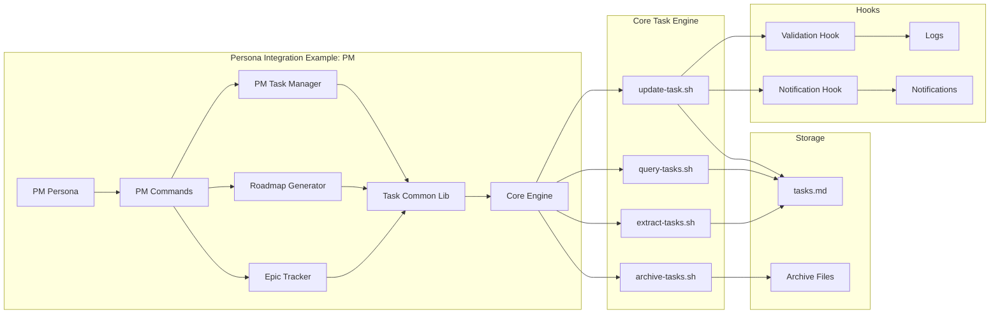

### Data Flow Architecture

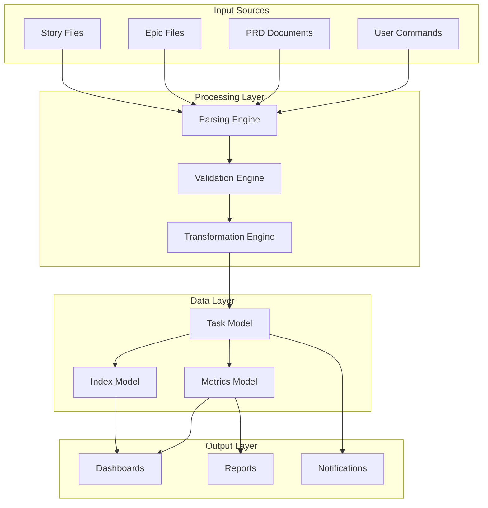

### Task Extraction Workflow

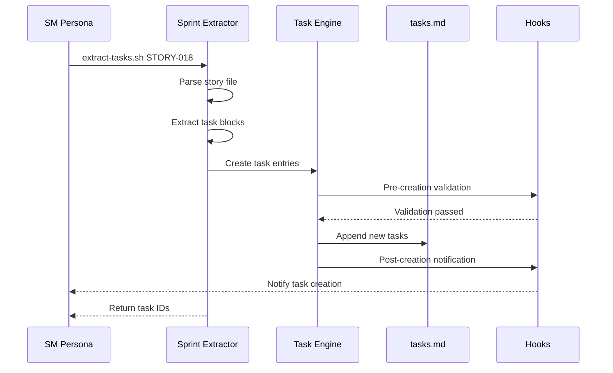

### Cross-Persona Handoff Workflow

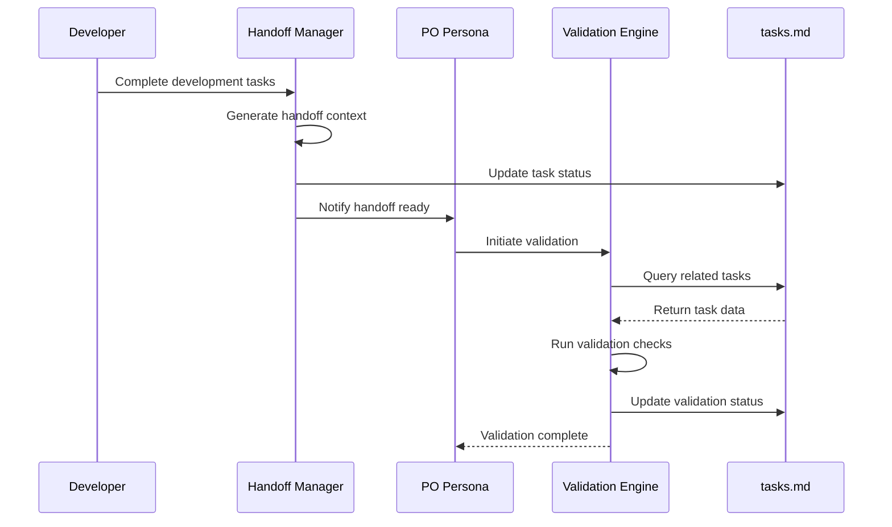

### System-wide Orchestration

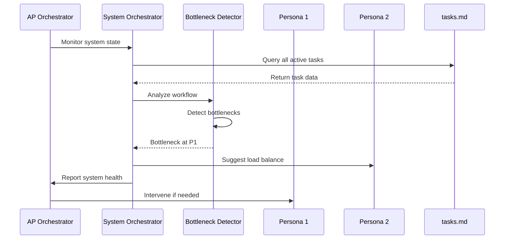

### Task Lifecycle State Machine

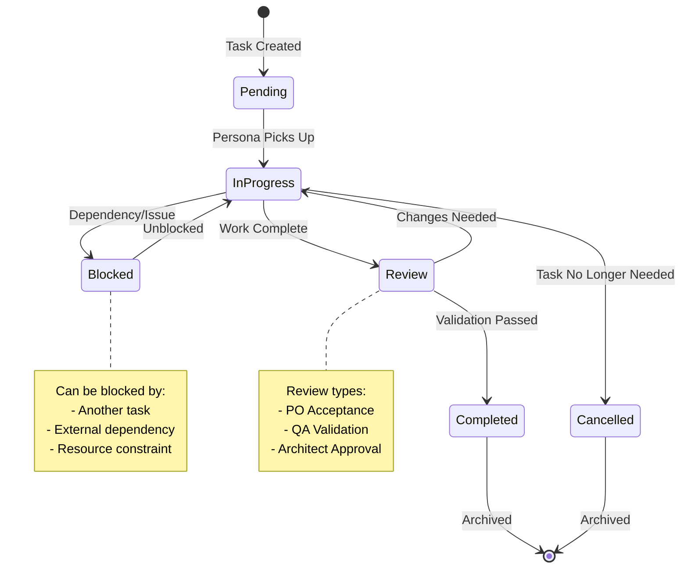

### Performance Optimization Strategy

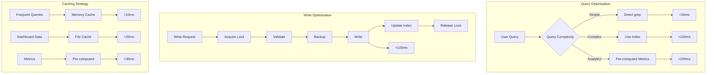

## Definitive Tech Stack Selections

| Category             | Technology              | Version / Details | Description / Purpose                   | Justification |
| :------------------- | :---------------------- | :---------------- | :-------------------------------------- | :------------ |
| **Languages**        | Bash                    | 5.0+              | Primary scripting for task operations   | Native to environment, fast execution |
|                      | Python                  | 3.8+              | Hook implementations and complex logic  | Better for complex data processing |
| **Runtime**          | Linux/WSL               | Ubuntu 20.04+     | Shell script execution environment      | Claude Code environment |
| **Data Storage**     | Markdown                | CommonMark        | Task data format                        | Human-readable, git-friendly |
|                      | Flat Files              | UTF-8             | Single file database approach           | Performance, simplicity |
| **Version Control**  | Git                     | 2.25+             | Change tracking and collaboration       | Industry standard |
| **Query Engine**     | grep/ripgrep            | Latest            | Fast text search in task files          | Optimized for performance |
| **Text Processing**  | sed/awk                 | POSIX             | Task data manipulation                  | Standard Unix tools |
| **Testing**          | bats                    | 1.5+              | Bash script testing framework           | Bash-native testing |
|                      | pytest                  | 7.0+              | Python hook testing                     | Python standard |
| **Documentation**    | Markdown                | CommonMark        | All documentation format                | Consistency with tasks |
| **Scheduling**       | cron (optional)         | Standard          | Periodic task operations                | For archival, metrics |
| **JSON Processing**  | jq                      | 1.6+              | JSON data manipulation in scripts       | Efficient JSON handling |
| **File Watching**    | inotify-tools           | 3.20+             | File change detection (optional)        | Real-time updates |

## Infrastructure and Deployment Overview

- **Deployment Model**: Local execution within Claude Code environment
- **Core Services**: File system operations, bash script execution
- **Infrastructure as Code**: Not applicable (local scripts)
- **Deployment Strategy**: Git-based distribution with setup scripts
- **Environments**: 
  - Development: Local AP Method installation
  - Production: Same as development (no separate environments)
- **Installation**: Via `agentic-setup` script
- **Updates**: Git pull or AP Manager update command
- **Rollback Strategy**: Git revert for script changes, file backup for data

### Deployment Architecture Diagram

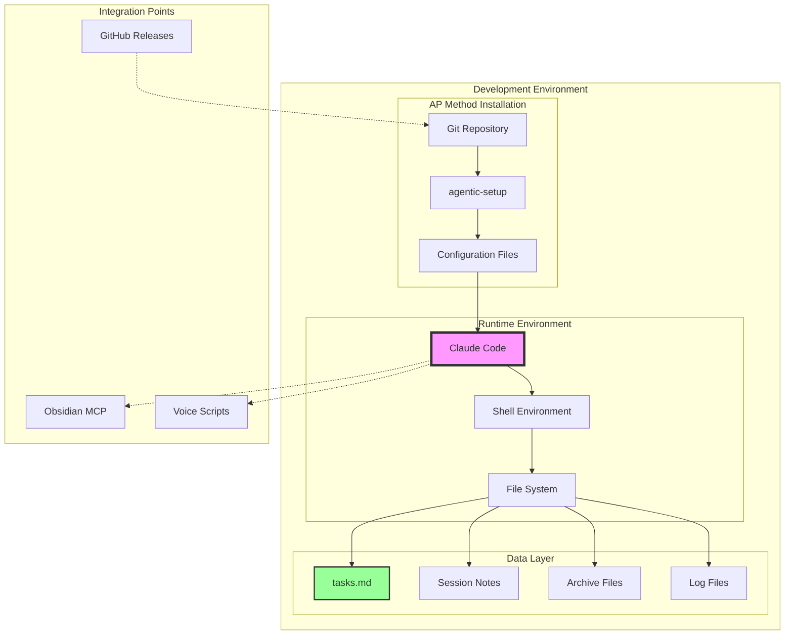

### System Integration Points

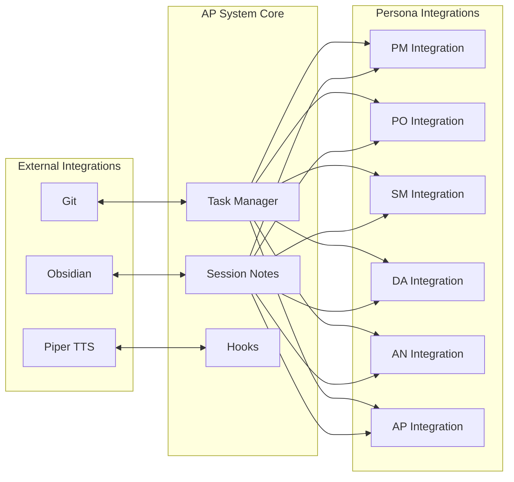

## Error Handling Strategy

- **General Approach:** Defensive scripting with explicit error checking after each operation
- **Logging:**
  - Method: Structured logging to `$PROJECT_DOCS/session-notes/logs/task-operations.log`
  - Format: `[TIMESTAMP] [LEVEL] [SCRIPT] [OPERATION] [MESSAGE]`
  - Levels: DEBUG, INFO, WARN, ERROR
  - Context: Task ID, persona, operation type
- **Specific Handling Patterns:**
  - File Operations: Check file existence, permissions, lock files before write
  - Task Updates: Validate task existence, backup before update
  - Dependencies: Verify dependency chain integrity
  - Concurrent Access: Use lock files to prevent race conditions
- **Recovery Mechanisms:**
  - Automatic backups before destructive operations
  - Rollback capability for failed updates
  - Orphaned lock cleanup on startup

## Coding Standards

### Bash Script Standards

- **Style Guide**: Google Shell Style Guide
- **Script Structure**:
  ```bash
  #!/usr/bin/env bash
  set -euo pipefail  # Strict error handling
  
  # Script description
  # Usage: script.sh [args]
  
  # Constants
  readonly SCRIPT_DIR="$(cd "$(dirname "${BASH_SOURCE[0]}")" && pwd)"
  readonly TASKS_FILE="${PROJECT_DOCS}/session-notes/tasks/tasks.md"
  
  # Functions
  function validate_task_id() {
    local task_id="$1"
    [[ "$task_id" =~ ^TASK-[0-9]{3}-[0-9]{3}-[0-9]{2}$ ]] || return 1
  }
  
  # Main
  main() {
    # Implementation
  }
  
  main "$@"
  ```

- **Naming Conventions**:
  - Scripts: `kebab-case.sh`
  - Functions: `snake_case`
  - Variables: `UPPER_SNAKE_CASE` for constants, `lower_snake_case` for locals
  - Task IDs: `TASK-XXX-YYY-ZZ` format

- **Error Handling**:
  - Always check command exit codes
  - Use `|| error_handler` pattern
  - Provide meaningful error messages

### Python Hook Standards

- **Style Guide**: PEP 8 with Black formatter
- **Type Hints**: Required for all functions
- **Structure**:
  ```python
  #!/usr/bin/env python3
  """Hook description."""
  
  from typing import Dict, List, Optional
  import logging
  
  logger = logging.getLogger(__name__)
  
  def process_task(task_data: Dict[str, str]) -> Optional[Dict[str, str]]:
      """Process task with validation."""
      try:
          # Implementation
          return processed_data
      except Exception as e:
          logger.error(f"Task processing failed: {e}")
          raise
  ```

## Overall Testing Strategy

- **Tools**: bats for bash scripts, pytest for Python hooks
- **Unit Tests**:
  - Scope: Individual functions in scripts and hooks
  - Location: `tests/unit/` mirroring source structure
  - Coverage: All public functions, error paths
- **Integration Tests**:
  - Scope: End-to-end workflows (extract → query → update → archive)
  - Location: `tests/integration/`
  - Approach: Use test task files, verify state changes
- **Performance Tests**:
  - Scope: Ensure <100ms operation times
  - Location: `tests/performance/`
  - Metrics: Operation time, file size impact
- **Test Data**: Generated test stories and tasks in `tests/fixtures/`

## Security Best Practices

- **Input Validation**: All task IDs, file paths, and parameters validated before use
- **File Permissions**: Tasks file readable by user only (chmod 600)
- **Path Traversal Prevention**: Absolute paths resolved, no `../` allowed
- **Command Injection Prevention**: No eval or unquoted variable expansion
- **Secrets Management**: No secrets in task data or logs
- **Audit Trail**: All operations logged with timestamp and user context
- **Data Sanitization**: Strip potentially harmful content from task descriptions
- **Backup Security**: Automated backups with same permission restrictions

## Key Reference Documents

- [STORY-002-design-session-notes-tasks.md](../stories/STORY-002-design-session-notes-tasks.md) - Original task system design
- [TASK-MANAGEMENT-GUIDE.md](../TASK-MANAGEMENT-GUIDE.md) - User guide for task management
- [epic-subtask-integration.md](../epics/epic-subtask-integration.md) - Overall integration epic
- [task-hooks-implementation-summary.md](../stories/task-hooks-implementation-summary.md) - Hook system details

## Implementation Examples

### Example 1: PM Epic Progress Tracking

```bash
#!/usr/bin/env bash
# agents/integrations/pm/epic-tracker.sh

source "${SCRIPT_DIR}/../../lib/task-common.sh"

function calculate_epic_progress() {
    local epic_id="$1"
    local total_tasks=0
    local completed_tasks=0
    
    # Query all tasks for the epic
    while IFS= read -r task_line; do
        ((total_tasks++))
        if [[ "$task_line" =~ "**Status**: completed" ]]; then
            ((completed_tasks++))
        fi
    done < <(query_tasks.sh -e "$epic_id")
    
    # Calculate percentage
    local progress=0
    if [[ $total_tasks -gt 0 ]]; then
        progress=$((completed_tasks * 100 / total_tasks))
    fi
    
    # Output JSON metrics
    cat <<EOF
{
    "epic_id": "$epic_id",
    "total_tasks": $total_tasks,
    "completed_tasks": $completed_tasks,
    "progress_percentage": $progress,
    "timestamp": "$(date -u +%Y-%m-%dT%H:%M:%SZ)"
}
EOF
}
```

### Example 2: PO Validation Workflow

```python
# .claude/hooks/task_validation.py
#!/usr/bin/env python3
"""Task validation hook for PO acceptance criteria."""

import re
from typing import Dict, List, Optional
from dataclasses import dataclass

@dataclass
class ValidationResult:
    passed: bool
    criteria_met: List[str]
    criteria_failed: List[str]
    notes: str

def validate_story_tasks(story_id: str) -> ValidationResult:
    """Validate all tasks for a story meet acceptance criteria."""
    
    # Load acceptance criteria from story file
    criteria = load_acceptance_criteria(story_id)
    
    # Check each criterion against completed tasks
    criteria_met = []
    criteria_failed = []
    
    for criterion in criteria:
        if check_criterion_met(story_id, criterion):
            criteria_met.append(criterion)
        else:
            criteria_failed.append(criterion)
    
    passed = len(criteria_failed) == 0
    
    return ValidationResult(
        passed=passed,
        criteria_met=criteria_met,
        criteria_failed=criteria_failed,
        notes=f"Story {story_id}: {len(criteria_met)}/{len(criteria)} criteria met"
    )
```

### Example 3: SM Sprint Dashboard Generation

```markdown
# Sprint Dashboard - SPRINT-2025-01
Generated: 2025-01-11 15:00:00 UTC

## Sprint Overview
- **Sprint Goal**: Complete persona task management integrations
- **Duration**: 2025-01-08 to 2025-01-22
- **Team Capacity**: 240 hours

## Progress Metrics
| Metric | Value | Target | Status |
|--------|-------|--------|--------|
| Velocity | 23 points | 26 points | 🟡 |
| Task Completion | 67% | 75% | 🟡 |
| Blocked Tasks | 3 | 0 | 🔴 |
| Code Review Queue | 5 | <3 | 🟡 |

## Task Distribution by Persona
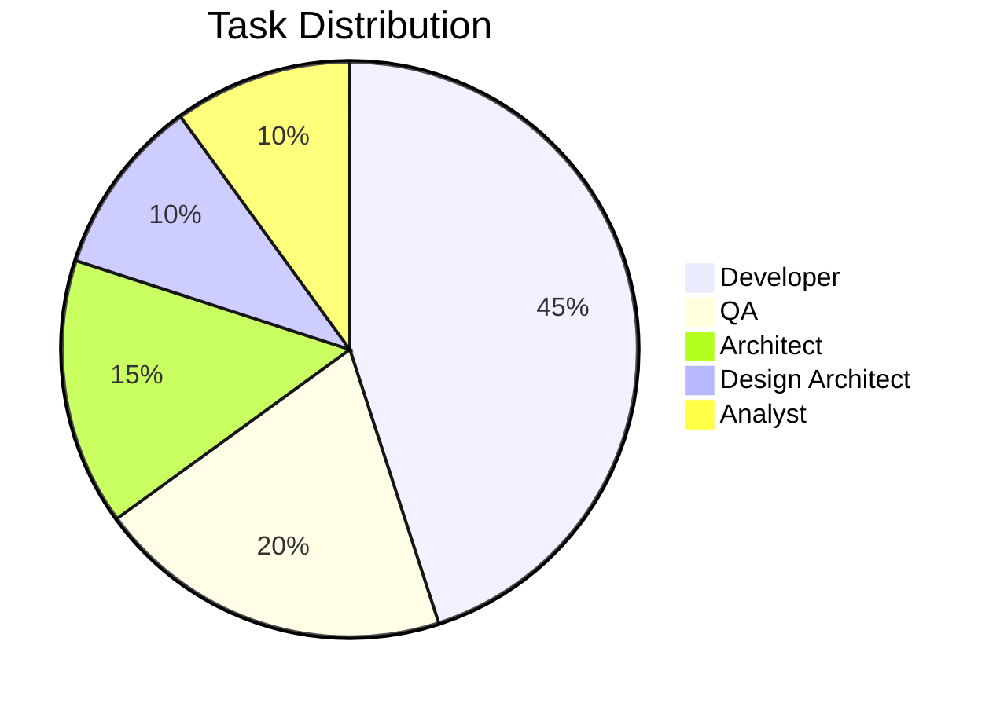

## Burndown Chart
```
Points Remaining
40 |*
35 |  *
30 |    *
25 |      *
20 |        *  <- Current
15 |          *
10 |            *
5  |              *
0  |________________*
   M T W T F M T W T F
```

## Blocked Tasks
1. **TASK-001-016-03**: Waiting on architecture review
2. **TASK-001-017-02**: External API documentation needed
3. **TASK-001-018-05**: Dependency on TASK-001-016-03

## Action Items
- [ ] Unblock architecture review for PM integration
- [ ] Schedule API documentation session
- [ ] Reallocate resources from completed stories
```

### Example 4: Cross-Persona Handoff Context

```json
{
  "handoff_id": "HANDOFF-2025-01-11-001",
  "from_persona": "developer",
  "to_persona": "qa",
  "timestamp": "2025-01-11T15:30:00Z",
  "tasks": [
    "TASK-001-016-02",
    "TASK-001-016-03",
    "TASK-001-016-04"
  ],
  "context": {
    "summary": "PM integration core modules completed. Ready for testing.",
    "artifacts": [
      "agents/integrations/pm/pm-task-manager.sh",
      "agents/integrations/pm/epic-tracker.sh",
      "tests/unit/pm/test_pm_task_manager.bats"
    ],
    "decisions": [
      {
        "decision": "Used JSON output format for metrics",
        "rationale": "Better integration with dashboards"
      },
      {
        "decision": "Implemented caching for epic queries",
        "rationale": "Performance optimization for large epics"
      }
    ],
    "openQuestions": [
      "Should epic progress include cancelled tasks?",
      "Need clarification on roadmap visualization format"
    ],
    "recommendations": "Focus testing on edge cases with 50+ tasks per epic"
  }
}
```

### Example 5: Task File Index Structure

```yaml
# .task-index.yaml
index_version: "1.0"
generated: "2025-01-11T16:00:00Z"
total_tasks: 347
task_index:
  by_status:
    pending: [TASK-001-016-05, TASK-001-016-06, ...]
    in_progress: [TASK-001-016-03, TASK-001-017-02, ...]
    completed: [TASK-001-016-01, TASK-001-016-02, ...]
  by_persona:
    developer: [TASK-001-016-02, TASK-001-016-03, ...]
    qa: [TASK-001-016-11, TASK-001-017-10, ...]
    architect: [TASK-001-016-01, TASK-001-017-01, ...]
  by_epic:
    EPIC-001: [TASK-001-016-01, TASK-001-016-02, ...]
  dependencies:
    TASK-001-016-02: [TASK-001-016-01]
    TASK-001-016-03: [TASK-001-016-01]
metrics:
  completion_rate: 0.67
  average_cycle_time: 14.5  # hours
  blocked_percentage: 0.08
```

## Change Log

| Change | Date - Time | Version | Description | Author |
|--------|-------------|---------|-------------|--------|
| Initial Creation | 2025-01-11 - 14:30 | 1.0.0 | Created comprehensive architecture for persona task integration | Architect Agent |
| Added Examples | 2025-01-11 - 15:45 | 1.1.0 | Added implementation examples and additional diagrams | Architect Agent |

--- End of Architecture Document ---