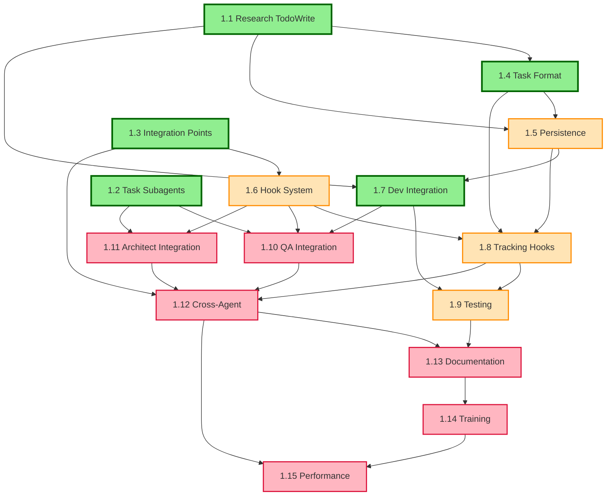

# Story Dependencies and Sequencing Guide

## Dependency Graph

## Critical Path Analysis

### Primary Critical Path
1.1 → 1.4 → 1.5 → 1.7 → 1.8 → 1.9 → 1.10 → 1.12 → 1.13 → 1.14 → 1.15

**Duration**: 10 weeks (if sequential)
**Optimization**: Parallel tracks reduce to 6 weeks

### Parallel Execution Tracks

#### Track A: Core Infrastructure
- Week 1-2: Stories 1.1, 1.2, 1.3 (Research) ✅
- Week 3: Stories 1.4 ✅, 1.5 (Formats & Persistence)
- Week 4: Story 1.6 (Hook System)
- Week 5: Story 1.8 (Implementation)

#### Track B: Integration Development  
- Week 3-4: Story 1.7 (Dev Integration) ✅
- Week 5: Story 1.9 (Testing)
- Week 6: Story 1.10 (QA Integration)
- Week 7: Story 1.11 (Architect Integration)

#### Track C: Unification & Rollout
- Week 7: Story 1.12 (Cross-Agent)
- Week 8: Story 1.13 (Documentation)
- Week 9: Story 1.14 (Training)
- Week 10: Story 1.15 (Performance)

## Detailed Dependency Specifications

### Story 1.5: Persistence Architecture
**Hard Dependencies**:
- 1.1: Must understand TodoWrite format constraints
- 1.4: Requires universal task format specification

**Soft Dependencies**:
- 1.3: Benefits from integration point knowledge

**Provides For**:
- 1.7: Persistence layer for dev integration
- 1.8: Storage backend for tracking hooks
- All subsequent stories requiring state management

### Story 1.6: Hook Integration System
**Hard Dependencies**:
- 1.3: Must know all integration points

**Soft Dependencies**:
- 1.1: Understanding of TodoWrite events helpful

**Provides For**:
- 1.8: Hook infrastructure
- 1.10, 1.11: Agent-specific hooks
- 1.12: Cross-agent event system

### Story 1.8: Task Tracking Hooks
**Hard Dependencies**:
- 1.4: Task format for transformations
- 1.5: Persistence layer for storage
- 1.6: Hook system infrastructure

**Soft Dependencies**:
- 1.7: Developer integration patterns

**Provides For**:
- 1.9: Hooks to test
- 1.12: Event stream for visibility

### Story 1.9: Testing Framework
**Hard Dependencies**:
- 1.7: Dev integration to test
- 1.8: Tracking hooks to validate

**Soft Dependencies**:
- 1.2: Parallel testing patterns

**Provides For**:
- All subsequent stories (quality assurance)

### Story 1.10: QA Integration
**Hard Dependencies**:
- 1.2: Parallel execution patterns
- 1.6: Hook system for test events
- 1.7: Reference implementation

**Soft Dependencies**:
- 1.9: Testing patterns

**Provides For**:
- 1.12: QA data for unified view

### Story 1.11: Architect Integration
**Hard Dependencies**:
- 1.2: Parallel analysis patterns
- 1.6: Hook system
- 1.7: Reference implementation

**Soft Dependencies**:
- 1.10: Can share patterns

**Provides For**:
- 1.12: Architecture data for visibility

### Story 1.12: Cross-Agent Visibility
**Hard Dependencies**:
- 1.8: Event stream from hooks
- 1.10: QA integration data
- 1.11: Architect integration data

**Soft Dependencies**:
- 1.3: Integration points knowledge

**Provides For**:
- 1.13: Content for documentation
- 1.15: Performance monitoring points

## Sequencing Strategies

### Minimum Viable Product (MVP) Path
1. **Week 1**: Complete 1.5 (Persistence)
2. **Week 2**: Complete 1.6 (Hooks) + 1.8 (Tracking)
3. **Week 3**: Complete 1.9 (Testing)
4. **Week 4**: Release MVP with basic dev integration

**MVP Features**:
- Basic task extraction
- TodoWrite integration
- Persistence to CLAUDE.md
- Simple progress tracking

### Full Implementation Path

#### Phase 1: Foundation (Weeks 1-2)
Already completed: 1.1, 1.2, 1.3, 1.4, 1.7

#### Phase 2: Core Systems (Weeks 3-4)
Priority Order:
1. **1.5** - Persistence (Monday-Tuesday)
2. **1.6** - Hooks (Wednesday-Thursday)
3. **1.8** - Tracking (Friday-Monday)
4. **1.9** - Testing (Tuesday-Wednesday)

#### Phase 3: Agent Integration (Weeks 5-6)
Parallel Execution:
- Developer A: **1.10** - QA Integration
- Developer B: **1.11** - Architect Integration
- Both: **1.12** - Cross-Agent Visibility

#### Phase 4: Polish (Weeks 7-8)
Sequential:
1. **1.13** - Documentation (capture learnings)
2. **1.14** - Training (enable adoption)
3. **1.15** - Performance (ensure scalability)

## Risk Management

### High-Risk Dependencies
1. **1.5 → Everything**: Persistence failure blocks all progress
   - Mitigation: Implement simple file-based backup first
   
2. **1.6 → 1.8**: Hook system complexity could delay tracking
   - Mitigation: Start with basic event system, enhance later

3. **1.12 Complexity**: Integrating multiple agents is challenging
   - Mitigation: Start with 2-agent visibility, expand gradually

### Contingency Plans

#### If Persistence (1.5) is Delayed:
- Use simple JSON file storage
- Implement in-memory cache
- Defer advanced features

#### If Parallel Execution (1.2 patterns) Fails:
- Fall back to sequential processing
- Implement basic concurrency limits
- Optimize later in 1.15

#### If Hook System (1.6) is Complex:
- Start with hardcoded integration points
- Add dynamic registration later
- Focus on critical paths only

## Optimal Execution Order

### For Single Developer
1. **1.5** - Persistence Architecture (2 days)
2. **1.6** - Hook Integration System (2 days)
3. **1.8** - Task Tracking Hooks (2 days)
4. **1.9** - Testing Framework (2 days)
5. **1.10** - QA Integration (2 days)
6. **1.11** - Architect Integration (2 days)
7. **1.12** - Cross-Agent Visibility (3 days)
8. **1.13** - Documentation (2 days)
9. **1.14** - Training Materials (2 days)
10. **1.15** - Performance Optimization (3 days)

**Total**: 22 days

### For Two Developers

**Developer 1**:
- 1.5 - Persistence (2 days)
- 1.8 - Tracking Hooks (2 days)
- 1.10 - QA Integration (2 days)
- 1.13 - Documentation (2 days)
- 1.15 - Performance (3 days)

**Developer 2**:
- 1.6 - Hook System (2 days)
- 1.9 - Testing (2 days)
- 1.11 - Architect Integration (2 days)
- 1.12 - Cross-Agent (3 days)
- 1.14 - Training (2 days)

**Total**: 11 days (parallel)

## Success Metrics by Phase

### Phase 2 Completion (Stories 5-6)
- Persistence layer handling 1000+ tasks
- Hook system processing 100+ events/second
- Zero data loss during failures

### Phase 3 Completion (Stories 8-9)
- All hooks firing correctly
- 95% test coverage
- Sub-second state synchronization

### Phase 4 Completion (Stories 10-12)
- 3+ personas integrated
- Unified view updating in real-time
- 40% efficiency improvement demonstrated

### Phase 5 Completion (Stories 13-15)
- Documentation rated 4.5+ stars
- 80% user adoption
- Performance targets met

## Conclusion

This dependency and sequencing guide provides multiple paths to complete the epic, accounting for different team sizes and risk tolerances. The critical path is clearly identified, with contingencies for common risks.

Following this guide ensures:
1. No blocking dependencies
2. Optimal parallelization
3. Risk mitigation
4. Clear progress metrics
5. Flexible execution options